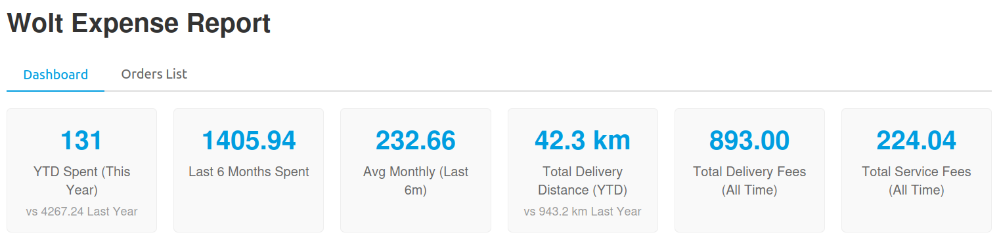
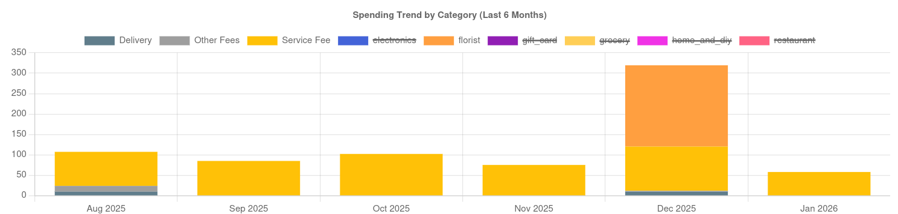
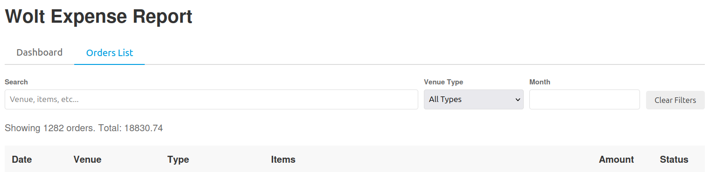

# Wolt CLI Expense Tracker

A CLI tool to track your Wolt expenses by fetching order history and generating interactive HTML reports. Helps you understand the "real" cost of food delivery so we can cry together.

This is a "quick and dirty" implementation mostly to satisfy curiosity and offload most of the code generation to Gemini, don't expect anything smart in the source code.

## Features

- **Incremental Sync**: Fetches only new orders to save time / avoid non-necessary API calls.
- **Local Storage**: Saves order history locally in `~/.wolt-cli/orders.json`.
- **HTML Reports**: Generates a searchable, filterable HTML report with spending summaries.
- **CSV Export**: Export order history to CSV for use in spreadsheets.
- **Token Validation**: Validates your API token on save so you know immediately if it's expired.
- **Graceful Interrupts**: Press Ctrl+C during sync and your progress is saved, not lost.

## Examples







## Installation

1.  Clone the repository:
    ```bash
    git clone <repository-url>
    cd wolt-cli
    ```
2.  Install dependencies:
    ```bash
    npm install
    ```
3.  Link the CLI globally (optional):
    ```bash
    npm link
    ```

## Usage

### 1. Configuration

You need your Wolt Authorization token.
1.  Log in to Wolt in your browser.
2.  Open Developer Tools (Network tab).
3.  Navigate to the ["Order History" page](https://wolt.com/en/me/order-history).
4.  Find a request to `order_history`.
5.  Copy the value of the `Authorization` header (it starts with `Bearer ...`).

Run the config command:
```bash
wolt-cli config
```
and provide token value when prompted. The token is validated against the Wolt API before saving. To skip validation:
```bash
wolt-cli config --skip-validation
```

Unfortunately, automatic token retrieval is blocked due to Wolt's bot-detection. So you'll need to do this periodically.

### 2. Sync Orders

Fetch your order history and save it locally.

```bash
wolt-cli sync
```

To force a full re-sync (delete local cache and fetch everything again):
```bash
wolt-cli sync --force
```

You can safely press Ctrl+C during sync -- any progress made so far will be saved.

### 3. Generate Report

Generate an HTML report from your local data.

```bash
wolt-cli report --output expenses.html
```

To generate and open in your browser in one step:
```bash
wolt-cli report --open
```

### 4. Export to CSV

Export your order history to a CSV file for use in Excel, Google Sheets, etc.

```bash
wolt-cli export
wolt-cli export --output my-orders.csv
```

### 5. Check Status

View a quick summary of your local data without generating a report.

```bash
wolt-cli status
```

```
  Wolt CLI Status
  ───────────────────────────────
  Orders stored:     247
  With details:      247/247
  Date range:        2022-03-15 to 2026-01-28
  Total spent:       48231.50 (valid orders)
  Storage size:      4.2 MB
  Storage path:      ~/.wolt-cli/orders.json
```

## Data Location

- **Orders**: `~/.wolt-cli/orders.json`
- **Config**: `~/.wolt-cli/config.json`
